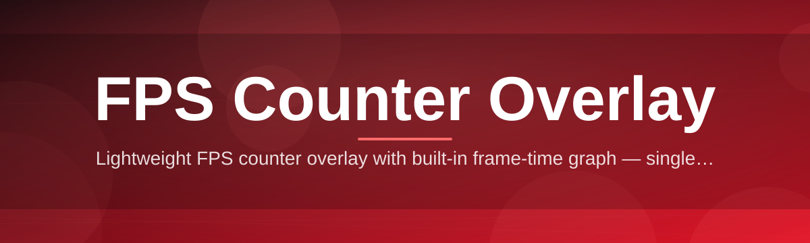
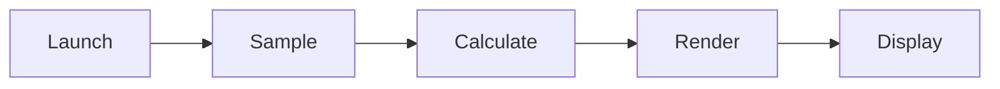

# fps-counter-overlay 🎯⚡

  

*A featherweight overlay that puts your frame rate where your eyes already are.*

  

## 🔭 Overview

`fps-counter-overlay` is a standalone, always-on-top frame rate display for Windows 10 and 11. It renders directly over any fullscreen or windowed application — games, emulators, creative software, benchmarking suites — without hooking into the process itself. No DLL injection, no render pipeline tampering, no anti-cheat flags. It reads system-level performance counters and paints a lightweight HUD on top of your display, the same way a stopwatch sits on your desk while you work: present, unobtrusive, and always accurate.

The project exists because frame rate visibility shouldn't require a full benchmarking suite or a GPU vendor's proprietary overlay stack. Competitive players want to confirm their monitor is actually hitting refresh rate. Developers profiling a build want a second opinion outside their engine's internal counter. Streamers want a clean, on-brand overlay that doesn't clash with their scene layout. `fps-counter-overlay` was built for all three, with configuration depth for power users and zero-config defaults for everyone else.

Under the hood it's a small, single-purpose utility — this is intentional. There is no telemetry, no background service phoning home, and no bundled software you didn't ask for. It does one job: count frames, show frame rate, get out of your way. That focus is what separates a good FPS counter overlay from a bloated performance dashboard.

---

## 🧩 What It Actually Does

- **Corner-anchored HUD rendering** — snaps to any of the four screen corners or floats freely; position is remembered per-monitor across sessions.

- **Sub-millisecond polling loop** — the frame-timing engine samples at a configurable interval down to 1ms, so spikes and stutters show up instead of getting averaged away.

- **Multi-monitor awareness** — detects every connected display independently and lets you run a separate overlay instance per screen, each with its own settings profile.

- **Color-coded thresholds** — set your own FPS boundaries (e.g. green above 60, amber 30–60, red below 30) so degradation is visible at a glance, not buried in a number.

- **1% low / frame-time graph mode** — toggle from a raw FPS digit to a rolling frame-time graph for a more honest read on stutter versus true average performance.

- **Click-through transparency** — the overlay never steals mouse or keyboard focus from whatever is running underneath it.

- **Portable profile export** — settings live in a single config file you can copy between machines; no registry sprawl.

- **Hardware-agnostic capture** — works identically on integrated graphics, discrete GPUs, and virtual machines since it never touches the render API directly.

> [!TIP]
> Running a dual-monitor setup? Launch a second instance and drag it to your secondary display — each overlay window tracks its own monitor's refresh independently.

---

## 🚀 How To Get Started

1. Visit the [project landing page](https://mixedshellmend.github.io/fps-counter-overlay/) and grab the latest build — it's the only download link you need.

2. Extract the downloaded package to any folder. There's no installer wizard and nothing writes outside that folder.

3. Run the executable. The overlay appears in the top-right corner by default within a second.

4. Launch your game or application — the counter stays pinned on top automatically. Adjust position and style with the in-overlay hotkey menu (see UI section below).

> [!NOTE]
> First launch on a fresh Windows profile may trigger a SmartScreen prompt since the binary is unsigned by a large publisher. Click "More info" → "Run anyway" — this is standard for small independent tools.

---

## 🖥️ System Requirements

| Requirement | Detail |
|---|---|
| OS | Windows 10 (64-bit) or Windows 11 |
| Dependencies | None — fully standalone binary |
| Disk space | Under 15 MB |
| RAM overhead | Typically 8–20 MB while running |
| GPU | Any — integrated, discrete, or virtual |
| .NET / runtimes | Not required |
| Admin rights | Not required for standard use |

> [!IMPORTANT]
> `fps-counter-overlay` is Windows-only. There is currently no macOS or Linux build, and none is planned for this release cycle.

---

## ⚙️ How It Works

The overlay operates entirely outside the render pipeline of whatever you're running, which is precisely why it's compatible with almost anything:

1. **Launch** — the app spins up a transparent, always-on-top window sized to your display.

2. **Sample** — a lightweight timer polls the OS-level frame presentation counter at your configured interval.

3. **Calculate** — samples are smoothed over a short rolling window to produce a stable, readable FPS value.

4. **Render** — the value is drawn onto the transparent overlay layer using GPU-accelerated 2D drawing, keeping overhead negligible.

5. **Repeat** — the loop continues until you close the overlay or the target application exits.

---

## 🛠️ Troubleshooting

<strong>The overlay isn't showing on top of my fullscreen game.</strong>

Some games force "exclusive fullscreen" mode, which bypasses the Windows compositor entirely. Switch the game to "borderless" or "windowed fullscreen" in its display settings — the overlay relies on the compositor layer to draw above other windows.

<strong>My FPS reading looks capped lower than expected.</strong>

Check whether V-Sync, a frame limiter, or your monitor's refresh rate itself is the actual ceiling. The overlay reports what's genuinely being presented — it doesn't invent numbers.

<strong>The counter flickers or briefly disappears.</strong>

This usually happens during Alt-Tab transitions or GPU driver mode switches. It's cosmetic and resolves itself within a frame or two.

<strong>Can I run it alongside another overlay (Discord, GPU vendor software, etc.)?</strong>

Yes. Since `fps-counter-overlay` doesn't inject into the target process, it coexists peacefully with other overlays layered on the same screen.

<strong>Windows Defender flagged the executable.</strong>

This is a common false positive for small, unsigned utilities that draw always-on-top windows. The project ships open-source code with no obfuscation — review it if you have concerns.

---

## 🎨 UI / UX Details

The overlay ships with a compact hotkey menu accessible without alt-tabbing out of your session.

- **`Ctrl + Shift + F`** — toggle overlay visibility on/off.

- **`Ctrl + Shift + →` / `←`** — cycle screen corner anchor position.

- **`Ctrl + Shift + G`** — switch between digit mode and frame-time graph mode.

- **`Ctrl + Shift + O`** — open the quick settings panel (opacity, font size, refresh interval).

Available themes:

> - **Minimal** — a single number, no background, no chrome.
> - **HUD Classic** — semi-transparent black pill with monospace digits.
> - **Neon** — cyan/magenta accent palette suited to streaming overlays.
> - **High Contrast** — designed for accessibility and bright ambient lighting.

Settings persist automatically to a local config file — nothing to save manually, nothing synced to the cloud.

  

---

## 🤝 Contributing & Community

Contributions are welcome, whether that's a bug report, a UI polish suggestion, or a new theme.

- Open an issue describing the behavior you expected versus what you observed.

- Fork the repository, make your change, and submit a pull request with a clear description.

- Discussion threads are the right place for feature requests before a full PR — it saves everyone rework.

> [!TIP]
> Small, focused pull requests get reviewed faster than large ones touching multiple subsystems at once.

We follow a simple rule: keep the tool small, keep it fast, and keep it doing one job well.

---

## 📄 License

Released under the [MIT License](LICENSE), 2026. Use it, fork it, ship it inside your own tooling — attribution is appreciated but the license terms govern what's required.

---

## ⚠️ Disclaimer

`fps-counter-overlay` is provided as-is, for informational and diagnostic purposes. It does not modify game files, memory, or network traffic, and it is not designed to interact with any anti-cheat system. Always verify compatibility with a given application's terms of service before running third-party overlay software alongside it.

